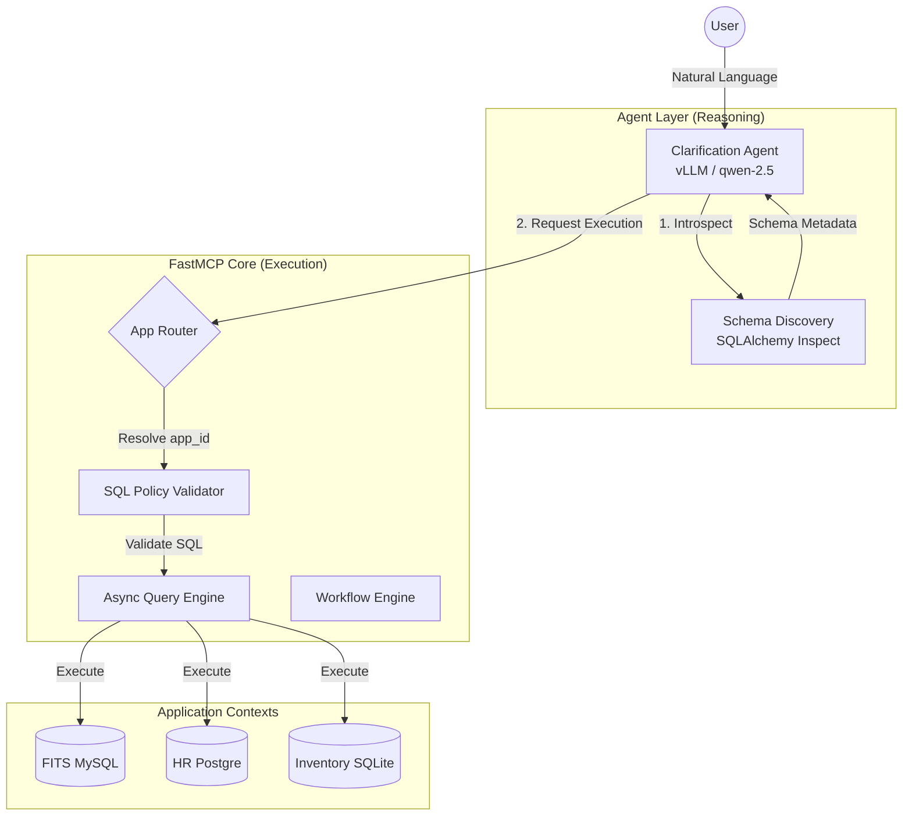
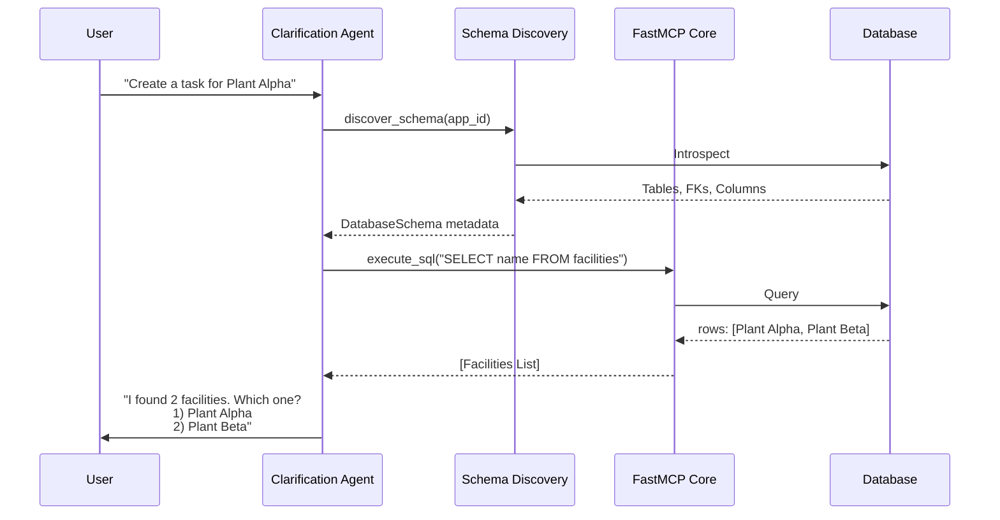

# Architecture

Date: 2026-03-19

The default shipped runtime is now the `simple` profile. In that profile, the application exposes the app-scoped chatbot, schema understanding, onboarding capture, and guarded DB execution paths. The chat fallback path can produce bounded SQL for safe reads and can stage writes behind an explicit confirmation turn. The admin, lifecycle, builder, and external-routing architecture described later in this document remains deferred behind the `platform` profile, and simple-mode startup should not construct those deferred services.

## System Architecture

## Internal Workflow

## Why This Shape

This architecture keeps the public surface simple without making MCP transport code responsible for business policy.

FastMCP is good at:

- transport
- typed tools
- session context
- middleware/auth integration

The internal core is where this project must stay explicit:

- capability discovery contracts
- policy
- validation
- state
- replay behavior
- domain rules

## Phase 2 Target Contracts

The current runtime already supports typed execution and app-scoped routing, but it does not yet have the request-normalization and enforcement layer needed for multi-app and future multi-tenant chat.

Phase 2 introduces three shared contracts before more agent behavior is added:

- `RequestContext`
  - trusted identity, role, tenant, app, origin, and session metadata
- `PolicyEnvelope`
  - immutable allowed scope and execution permissions derived before planning
- `RoutingPlan`
  - deterministic plan output validated against the envelope before execution

Detailed field-level design lives in `docs/enforcement-model.md`.

The baseline Phase 2 runtime implementation now exists in:

- `src/tag_fastmcp/core/request_context.py`
- `src/tag_fastmcp/core/policy_envelope.py`
- `src/tag_fastmcp/core/session_store.py`

That baseline currently wires:

- widget chat through request context and policy envelope derivation before the clarification agent runs
- direct tool execution through the same enforcement layer before report, workflow, SQL, schema, agent, or registry-routing execution proceeds

## Target Execution Sequence

The target request path should become:

1. build `RequestContext`
2. derive `PolicyEnvelope`
3. create `RoutingPlan`
4. validate selected capability against the envelope
5. execute through the existing guarded core
6. format output by channel and visibility rules
7. emit audit and approval events

This preserves the current core execution path while making scope enforcement happen before LLM reasoning.

## Execution Mode Split

### `app_chat`

- exactly one app in scope
- future tenant scope bound from trusted auth
- no cross-app capability expansion
- no heavy-agent escalation without an explicit architecture change

### `admin_chat`

- explicit privileged mode
- allowed app set derived from trusted auth or admin selection
- may request cross-app or heavy execution only when the envelope allows it

### `direct_tool`

- direct MCP clients still execute inside the same scope and audit contracts
- bypasses natural-language classification, not enforcement

## Phase 3 Target Agent Topology

The target agent topology is defined in `docs/agent-model.md`.

At the architecture level, the important boundary is:

- agents do planning and bounded reasoning
- the core still owns state, validation, capability filtering, SQL guardrails, and execution

The target set is:

- app scoped chat agent
- admin orchestration agent
- schema intelligence agent
- heavy cross-db agent
- agent proposal agent

The baseline Phase 3 runtime implementation now exists in:

- `src/tag_fastmcp/core/agent_registry.py`
- `src/tag_fastmcp/agent/admin_orchestration_agent.py`
- `src/tag_fastmcp/agent/schema_intelligence_agent.py`
- `src/tag_fastmcp/agent/stubs.py`

That baseline currently provides:

- a typed catalog for all five approved agent classes
- selection rules keyed off `RequestContext` and `PolicyEnvelope`
- a live bounded runtime for `admin_orchestration`
- a live bounded runtime for `schema_intelligence` understanding-document generation
- an interactive understanding-capture path that layers safe row previews and operator answers on top of schema intelligence output
- registry exposure of implemented versus stub or gated agent runtime state for the remaining agent classes

## Phase 4 Routing and Orchestration

The Phase 4 routing contract is defined in `docs/routing-orchestration.md`.

At the architecture level, the important separation is:

- intent planner and orchestration compiler decide what bounded execution should happen
- `CapabilityRouter` remains the deterministic execution dispatcher

The planner path should refine the current routing flow into:

1. intent analysis
2. candidate generation from the envelope-filtered registry
3. candidate ranking
4. clarification, rejection, direct execution, multi-step orchestration, or heavy escalation

The baseline Phase 4 runtime implementation now exists in:

- `src/tag_fastmcp/core/intent_planner.py`
- `src/tag_fastmcp/core/plan_compiler.py`
- `src/tag_fastmcp/core/orchestration_service.py`
- `src/tag_fastmcp/core/admin_chat_service.py`

That baseline currently provides:

- typed planning-side contracts for planning input, intent analysis, capability candidates, and orchestration decisions
- deterministic candidate ranking that prefers reports and workflows over speculative execution
- widget chat planning before direct agent fallback
- a minimal audited direct-tool orchestration path layered on top of `CapabilityRouter`
- an active admin orchestration runtime that reuses the same planner, compiler, formatter, and approval services over trusted HTTP context

## Phase 5 Formatter and UX Layer

The Phase 5 formatter contract is defined in `docs/formatter-ux.md`.

At the architecture level, the important separation is:

- formatter and visibility layers decide how approved data is shown
- they do not decide what data is allowed

The formatter path should refine the current output flow into:

1. derive visibility profile from the envelope
2. select allowed formatter for the channel
3. render text, card, or dashboard blocks
4. surface approval, escalation, degraded, or blocked state clearly

The baseline Phase 5 runtime implementation now exists in:

- `src/tag_fastmcp/core/visibility_policy.py`
- `src/tag_fastmcp/core/formatter_service.py`
- `src/tag_fastmcp/models/http_api.py`
- `src/tag_fastmcp/http_api.py`

That baseline currently provides:

- role-aware visibility profiles derived from `RequestContext` and `PolicyEnvelope`
- formatter-backed `ChannelResponse` presentation attached to routed MCP envelopes
- widget chat presentation attached to `WidgetChatResult`
- opt-in rich widget stream events layered over the existing token/result/error contract
- admin chat presentation attached to `AdminChatResult` and streamed over the HTTP adapter
- admin HTTP bearer JWT auth mapped into the existing admin context and enforcement path, with development header fallback for local console use

## Phase 6 Approval and Agent Lifecycle

The Phase 6 lifecycle contract is defined in `docs/approval-agent-lifecycle.md`.

At the architecture level, the important separation is:

- planner and formatter may signal approval-required state
- durable control-plane services own approval records, proposal drafts, registration, and activation

The lifecycle path should refine the current control flow into:

1. create approval or proposal draft records
2. pause execution or hold draft state
3. collect explicit reviewer decision
4. resume execution, register metadata, or activate only after durable state transition

The baseline Phase 6 runtime implementation now exists in:

- `src/tag_fastmcp/core/control_plane_store.py`
- `src/tag_fastmcp/core/approval_service.py`
- `src/tag_fastmcp/core/agent_lifecycle_service.py`
- `src/tag_fastmcp/core/admin_service.py`
- `src/tag_fastmcp/tools/lifecycle_tools.py`
- `src/tag_fastmcp/http_api.py`

That baseline currently provides:

- local SQL-backed durable storage for approval requests, execution payloads, proposal drafts, registration records, paused executions, and lifecycle audit events
- widget-chat and direct-tool pause points before execution when approval is required
- draft-first proposal creation for agent lifecycle requests
- explicit registration followed by separate activation
- trusted admin lifecycle MCP tools for queue visibility, approval decisions, proposal listing, registration, activation, and execution resume
- trusted admin HTTP routes that reuse the same core lifecycle service and envelope derivation
- dynamic exposure of activated registrations through `describe_capabilities`

## Phase 7 Visual Artifacts

The Phase 7 visual artifact contract is defined in `docs/visual-artifacts.md`.

At the architecture level, the important separation is:

- the visual layer makes policy, escalation, and approval states visible
- it does not become the source of truth for execution or lifecycle state

The Phase 7 demo should make these distinctions legible:

1. app chat versus admin chat are different operating modes
2. heavy-agent invocation is a visible escalation branch
3. new-agent creation is draft-first and approval-gated
4. formatter output is distinct from audit visibility

The baseline Phase 7 runtime implementation now exists in:

- `ui/src/App.jsx`
- `ui/src/components/LiveConsole.jsx`
- `ui/vite.config.js`

That baseline currently provides:

- the original architecture topology and scenario view
- live widget chat against `/session/start` and `/chat`
- live admin chat against `/admin/chat`
- live approval, proposal, and registration interactions against the admin HTTP lifecycle surface

## Phase 8 Codex Implementation Prompts

The Phase 8 prompt pack is defined in `docs/codex-implementation-prompts.md`.

At the architecture level, the important separation is:

- the prompt pack slices implementation into bounded phases
- it must stay aligned with the architectural contracts rather than drifting into a new parallel design

The prompt pack should preserve these rules:

1. enforcement lands before planner intelligence
2. planner behavior lands before formatter and lifecycle behavior
3. approval and registration remain separate from activation
4. UI work reflects backend truth rather than inventing it

## Target Platform Direction

The long-term platform should be assembled from distinct layers rather than forcing FastMCP to absorb every concern.

### Orchestration Layer

- `LangGraph`
- owns clarification loops
- owns multi-step agent state and continuation
- owns planner and routing decisions
- owns approval pause and resume points

### MCP Execution Layer

- `FastMCP`
- owns MCP server endpoints
- owns typed tool exposure
- owns session-aware entry points into safe internal capabilities
- should stay thin and deterministic

### AI Telemetry Layer

- `Langfuse`
- owns prompt, trace, span, eval, and debugging views for agent behavior

### Platform Observability Layer

- `OpenTelemetry`
- `Prometheus`
- `Grafana`
- `Loki`
- `Tempo`
- owns metrics, logs, traces, dashboards, and service-level troubleshooting

### Visual Topology Layer

- `React Flow`
- owns the visual graph of agents, MCP servers, routing, and execution timelines

### Shared State and Control Plane Data

- `Valkey` for cache, session state, idempotency, rate limits, short-lived workflow state, and lightweight pub/sub or streams
- `PostgreSQL` for tenants, registry data, audits, approvals, and durable workflow records

### Deployment Target

- `EKS`
- use it as the default production target for service isolation, observability plumbing, and future scale

## Problem Groups

To keep implementation tractable, split the system into five problem groups:

1. conversation and orchestration
2. MCP registry and routing
3. execution reliability
4. visual observability
5. application output formatting

These groups are the preferred boundary lines for planning phases, services, and ownership.

## Core Modules

### `settings.py`

Loads environment-backed runtime settings.

### `core/domain_registry.py`

Loads and validates the per-app domain contract from inline app config or an optional manifest file. Provides report and workflow lookup.

### `core/capability_registry.py`

Derives the typed plug-and-play registry snapshot for MCP servers, agents, apps, reports, workflows, external MCP tool registrations, channel formatter contracts, and tool capabilities from runtime settings plus app config or optional manifest config.

Near-term extension point:

- expand agent metadata beyond the current clarification entry so future orchestrators, heavy execution, and proposal workflows can be represented explicitly

### `core/capability_router.py`

Consumes the registry snapshot to select capabilities by `capability_id` or tags and dispatch them through the correct adapter path, including timeout, retry, circuit-breaker, and fallback handling for external MCP tools.

Near-term extension point:

- accept validated routing plans or envelope-filtered candidate sets instead of only raw app and tag inputs

Boundary to preserve:

- this module executes approved plans
- it should not absorb natural-language planning logic

### `core/circuit_breaker.py`

Tracks in-memory circuit-breaker state for registered external MCP servers so repeated failures do not keep hammering unhealthy dependencies.

### `core/chat_service.py`

Owns widget-facing app resolution, session bootstrap, conversation history reconstruction, and clarification-agent execution so chat state does not leak into the UI or MCP transport layer.

Near-term extension point:

- bind widget sessions to future request-context fields such as app, tenant, role, and channel

### `core/request_context.py`

Planned core module that should normalize trusted request metadata for widget chat, admin chat, direct MCP calls, and builder preview execution.

### `core/policy_envelope.py`

Planned core module that should derive immutable scope and visibility limits before any planner or agent selects a capability.

### `core/intent_planner.py`

Planned core module that should classify user intent, generate capability candidates, rank them, and choose clarification, execution, rejection, or escalation.

### `core/plan_compiler.py`

Planned core module that should turn planner output into one or more executable requests for the guarded dispatcher.

### `core/visibility_policy.py`

Planned core module that should derive role-aware output visibility from the policy envelope and execution mode.

### `core/formatter_service.py`

Planned core module that should select channel formatters and render channel-safe output blocks from execution results.

### `core/approval_service.py`

Current baseline core module that creates, decides, resumes, and audits approval requests for execution scopes and reviewer queues.

### `core/agent_lifecycle_service.py`

Current baseline core module that manages draft proposals, lifecycle approval sync, registration, activation, and related audit events.

### `core/control_plane_store.py`

Current baseline local durable store for approval, proposal, registration, paused execution, and lifecycle audit records. This should later move to the dedicated PostgreSQL control plane.

### `core/sql_policy.py`

Parses SQL with `sqlglot`, blocks forbidden commands, enforces table restrictions, and requires safe mutation filters.

### `core/query_engine.py`

Executes validated SQL against SQLite and bootstraps a development database for local work.

### `core/session_store.py`

Tracks per-session history, last query, and active workflow progress. Supports in-memory storage for local development and Valkey-backed persistence for multi-process runtimes.

### `core/idempotency.py`

Stores replay-safe responses keyed by a stable request fingerprint. Supports in-memory storage and Valkey-backed replay persistence with TTL control.

### `core/workflow_engine.py`

Runs small guided workflows using configured required fields and per-session state.

### `core/response_builder.py`

Builds the stable response envelopes shared by all tools.

### `builder/service.py`

Validates constrained builder graphs and previews them by calling FastMCP tools through a real client session.

## HTTP Adapter Layer

### `http_api.py`

Builds the combined ASGI service:

- mounts the FastMCP HTTP app at `/mcp`
- exposes `/apps` for frontend app discovery and picker state
- exposes `/session/start` for the widget session bootstrap
- exposes `/chat` as an NDJSON streaming endpoint compatible with the existing chatbot widget
- exposes admin chat and lifecycle routes with bearer JWT auth at the transport boundary
- keeps widget-specific transport behavior out of the internal core

Near-term extension point:

- map trusted widget auth and metadata into `RequestContext` before chat execution
- emit richer formatter blocks and state events once the formatter layer is implemented

## Tool Layers

### `tools/system_tools.py`

Session start, health, domain inspection, and capability registry discovery.

### `tools/routing_tools.py`

Thin MCP entry point for registry-driven capability invocation.

### `tools/query_tools.py`

Validated query execution and last-query summaries.

### `tools/report_tools.py`

Report execution based on configured SQL contracts.

### `tools/workflow_tools.py`

Workflow start and continuation.

### `tools/builder_tools.py`

Builder graph validation for future visual-builder integrations.

## Migration Direction

Near term:

- keep SQLite/in-memory stores for development
- use Valkey for ephemeral shared runtime state when multiple workers need session continuity or replay-safe caching
- add auth provider integration
- add `RequestContext`, `PolicyEnvelope`, and `RoutingPlan` as explicit shared contracts
- split app chat and admin chat into separate execution modes
- bind chat sessions to approved scope before planner work expands
- keep MCP tools thin
- use the capability registry as the onboarding contract for new apps, reports, workflows, and future adapters
- use `apps.yaml` as the config-only registration surface for external MCP server metadata and channel formatter contracts until the durable control plane lands
- use `invoke_capability` as the first routing surface so new orchestration code consumes the registry instead of hardcoded tool names
- keep reliability policy in the core router so retries, circuit breakers, and fallbacks remain deterministic and testable
- keep FastMCP focused on typed tool execution, not platform orchestration
- add compatibility HTTP adapters only when downstream clients need a non-MCP contract, and keep them thin over the shared core
- introduce LangGraph when clarification, routing, and approval logic becomes multi-step enough to justify a dedicated orchestrator

Long term:

- extend the capability registry to include external MCP servers, channels, approval gates, and formatter plugins from durable PostgreSQL-backed metadata
- move circuit-breaker and dependency health state to shared infrastructure when multiple workers need coordinated behavior
- move registry, tenant, audit, approval, and durable workflow records into PostgreSQL as the control-plane source of truth
- add Langfuse for AI-native trace and eval workflows
- add the OTel plus Grafana, Loki, Tempo, and Prometheus stack for platform-level observability
- use React Flow for live topology and execution graph views
- deploy the full platform to EKS
- add route planning / NL layer
- expand domain manifests
- support compatibility adapters only if still needed
