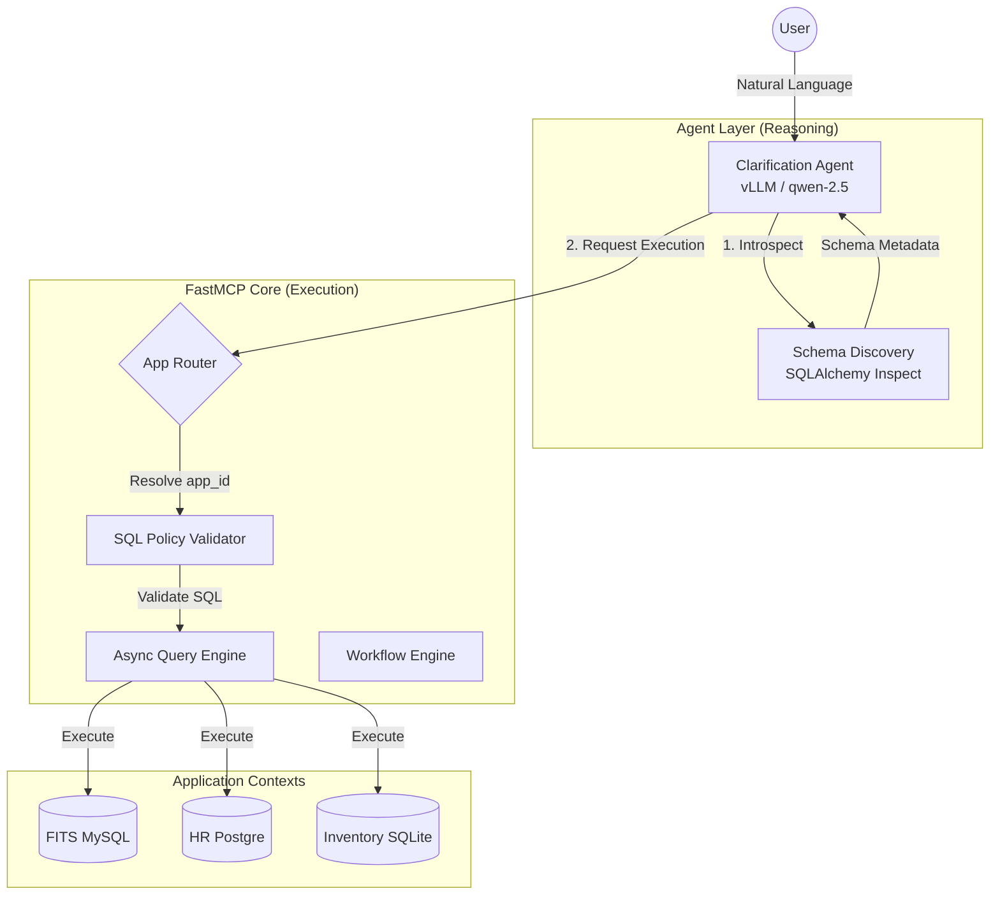
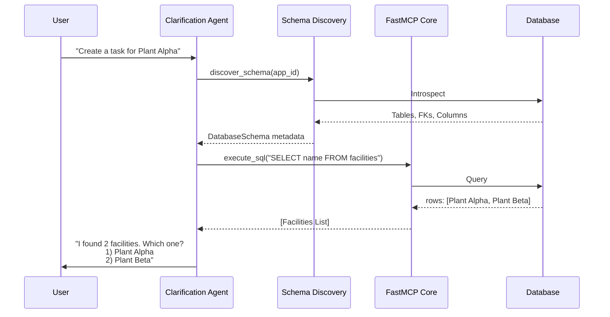

# Architecture

Date: 2026-03-16

## System Architecture

## Internal Workflow

## Why This Shape

This architecture keeps the public surface simple without making MCP transport code responsible for business policy.

FastMCP is good at:

- transport
- typed tools
- session context
- middleware/auth integration

The internal core is where this project must stay explicit:

- policy
- validation
- state
- replay behavior
- domain rules

## Core Modules

### `settings.py`

Loads environment-backed runtime settings.

### `core/domain_registry.py`

Loads and validates the domain manifest. Provides report and workflow lookup.

### `core/sql_policy.py`

Parses SQL with `sqlglot`, blocks forbidden commands, enforces table restrictions, and requires safe mutation filters.

### `core/query_engine.py`

Executes validated SQL against SQLite and bootstraps a development database for local work.

### `core/session_store.py`

Tracks per-session history, last query, and active workflow progress.

### `core/idempotency.py`

Stores replay-safe responses keyed by a stable request fingerprint.

### `core/workflow_engine.py`

Runs small guided workflows using manifest-defined required fields and per-session state.

### `core/response_builder.py`

Builds the stable response envelopes shared by all tools.

### `builder/service.py`

Validates constrained builder graphs and previews them by calling FastMCP tools through a real client session.

## Tool Layers

### `tools/system_tools.py`

Session start, health, and domain inspection.

### `tools/query_tools.py`

Validated query execution and last-query summaries.

### `tools/report_tools.py`

Report execution based on manifest-defined SQL.

### `tools/workflow_tools.py`

Workflow start and continuation.

### `tools/builder_tools.py`

Builder graph validation for future visual-builder integrations.

## Migration Direction

Near term:

- keep SQLite/in-memory stores for development
- add Redis-backed stores next
- keep MCP tools thin

Long term:

- add auth provider
- add route planning / NL layer
- expand domain manifests
- support compatibility adapters only if still needed
