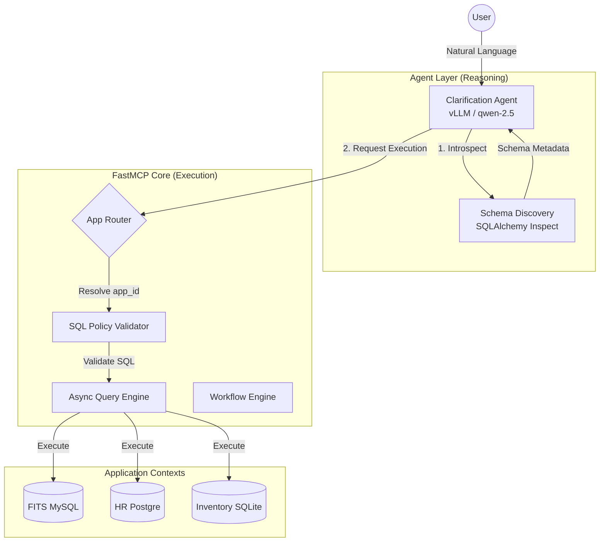
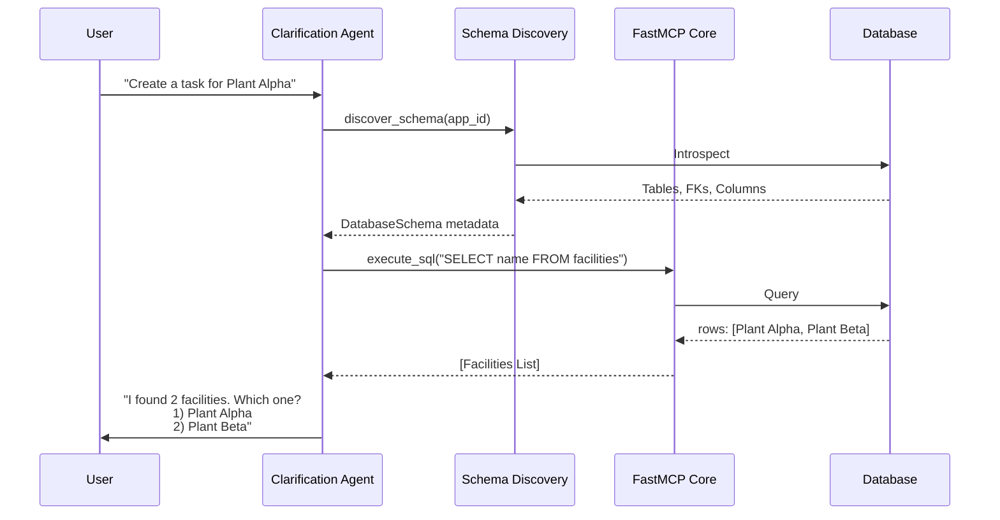

# Architecture

Date: 2026-03-16

## System Architecture

## Internal Workflow

## Why This Shape

This architecture keeps the public surface simple without making MCP transport code responsible for business policy.

FastMCP is good at:

- transport
- typed tools
- session context
- middleware/auth integration

The internal core is where this project must stay explicit:

- policy
- validation
- state
- replay behavior
- domain rules

## Target Platform Direction

The long-term platform should be assembled from distinct layers rather than forcing FastMCP to absorb every concern.

### Orchestration Layer

- `LangGraph`
- owns clarification loops
- owns multi-step agent state and continuation
- owns planner and routing decisions
- owns approval pause and resume points

### MCP Execution Layer

- `FastMCP`
- owns MCP server endpoints
- owns typed tool exposure
- owns session-aware entry points into safe internal capabilities
- should stay thin and deterministic

### AI Telemetry Layer

- `Langfuse`
- owns prompt, trace, span, eval, and debugging views for agent behavior

### Platform Observability Layer

- `OpenTelemetry`
- `Prometheus`
- `Grafana`
- `Loki`
- `Tempo`
- owns metrics, logs, traces, dashboards, and service-level troubleshooting

### Visual Topology Layer

- `React Flow`
- owns the visual graph of agents, MCP servers, routing, and execution timelines

### Shared State and Control Plane Data

- `Valkey` for cache, session state, idempotency, rate limits, short-lived workflow state, and lightweight pub/sub or streams
- `PostgreSQL` for tenants, registry data, audits, approvals, and durable workflow records

### Deployment Target

- `EKS`
- use it as the default production target for service isolation, observability plumbing, and future scale

## Problem Groups

To keep implementation tractable, split the system into five problem groups:

1. conversation and orchestration
2. MCP registry and routing
3. execution reliability
4. visual observability
5. application output formatting

These groups are the preferred boundary lines for planning phases, services, and ownership.

## Core Modules

### `settings.py`

Loads environment-backed runtime settings.

### `core/domain_registry.py`

Loads and validates the domain manifest. Provides report and workflow lookup.

### `core/sql_policy.py`

Parses SQL with `sqlglot`, blocks forbidden commands, enforces table restrictions, and requires safe mutation filters.

### `core/query_engine.py`

Executes validated SQL against SQLite and bootstraps a development database for local work.

### `core/session_store.py`

Tracks per-session history, last query, and active workflow progress. Supports in-memory storage for local development and Valkey-backed persistence for multi-process runtimes.

### `core/idempotency.py`

Stores replay-safe responses keyed by a stable request fingerprint. Supports in-memory storage and Valkey-backed replay persistence with TTL control.

### `core/workflow_engine.py`

Runs small guided workflows using manifest-defined required fields and per-session state.

### `core/response_builder.py`

Builds the stable response envelopes shared by all tools.

### `builder/service.py`

Validates constrained builder graphs and previews them by calling FastMCP tools through a real client session.

## Tool Layers

### `tools/system_tools.py`

Session start, health, and domain inspection.

### `tools/query_tools.py`

Validated query execution and last-query summaries.

### `tools/report_tools.py`

Report execution based on manifest-defined SQL.

### `tools/workflow_tools.py`

Workflow start and continuation.

### `tools/builder_tools.py`

Builder graph validation for future visual-builder integrations.

## Migration Direction

Near term:

- keep SQLite/in-memory stores for development
- use Valkey for ephemeral shared runtime state when multiple workers need session continuity or replay-safe caching
- add auth provider integration
- keep MCP tools thin
- keep FastMCP focused on typed tool execution, not platform orchestration
- introduce LangGraph when clarification, routing, and approval logic becomes multi-step enough to justify a dedicated orchestrator

Long term:

- move registry, tenant, audit, approval, and durable workflow records into PostgreSQL as the control-plane source of truth
- add Langfuse for AI-native trace and eval workflows
- add the OTel plus Grafana, Loki, Tempo, and Prometheus stack for platform-level observability
- use React Flow for live topology and execution graph views
- deploy the full platform to EKS
- add route planning / NL layer
- expand domain manifests
- support compatibility adapters only if still needed
