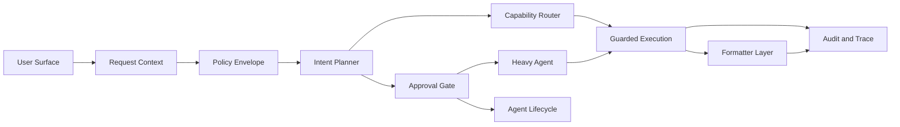
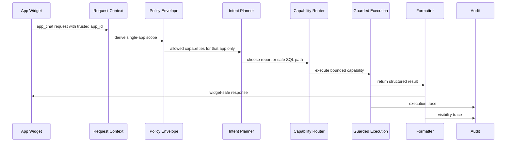
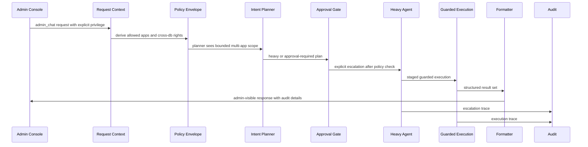
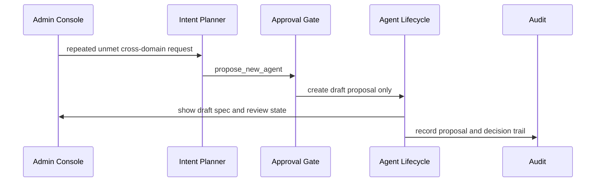

# Phase 7 Visual Artifacts

Date: 2026-03-19

This phase turns the architecture from Phases 2 through 6 into concrete visual artifacts.

The goal is not a full production frontend. The goal is a faithful visual model of how the system should behave once enforcement, planning, formatting, approvals, and agent lifecycle controls are implemented.

## Artifact Set

Phase 7 produces three artifacts:

1. a topology diagram for the target request path
2. a screen blueprint for app chat, admin orchestration, and approval review
3. a working React demo that makes those states visible

## Artifact 1: Topology Diagram

### Topology Intent

- `Request Context` exists before planning and never trusts prompt text for privilege.
- `Policy Envelope` is the hard scope boundary for apps, tenants, capabilities, and visibility.
- `Intent Planner` decides among clarify, execute, escalate, or propose, but only inside the envelope.
- `Approval Gate` is a visible branch, not hidden business logic.
- `Heavy Agent` and `Agent Lifecycle` are explicit operating modes rather than silent planner side effects.
- `Audit and Trace` receives both execution and presentation events.

## Artifact 2: Execution Storyboards

### App Chat Storyboard

### Admin Cross-App Storyboard

### Agent Proposal Storyboard

## Artifact 3: Screen Blueprint

The Phase 7 demo screen should contain four visible regions.

### Region A: Scenario Header

- phase badge
- scenario selector
- short statement of what the current scenario is proving

### Region B: Architecture Topology

- one React Flow canvas
- fixed topology, not a generic workflow builder
- node states change by scenario
- edge emphasis shows the active execution path

### Region C: User Surface Mockup

- app chat transcript for single-app mode
- admin orchestration transcript for cross-app mode
- proposal banner for draft-only agent creation mode
- output blocks should show what users see, not raw backend objects

### Region D: Control Rail

- policy envelope summary
- active agent set
- approval queue and lifecycle state
- audit visibility summary

## Demo Scenarios

The demo should support these three states.

### Scenario 1: App Scoped Chat

- single app only
- no cross-app expansion
- no heavy agent
- formatter returns widget-safe answer

### Scenario 2: Admin Cross-App Orchestration

- admin privilege explicit
- cross-app and cross-db reasoning allowed only because envelope permits it
- heavy agent shown as visible escalation
- approval queue can show pending or cleared review

### Scenario 3: Agent Proposal Draft

- planner identifies recurring unmet need
- no auto-activation
- draft appears in lifecycle state
- admin sees approval and registration steps before activation

## UX Rules

- app chat must never imply that cross-app access is available
- admin-wide access must be labeled as privileged mode
- escalation must feel deliberate, not automatic or hidden
- blocked requests should explain why they are blocked
- approval delays, rejections, and degraded execution must all be visible states

## Phase 7 Boundary

Phase 7 should implement:

- diagrams and screen structure
- a working React demo with scenario switching
- a visual language for approvals, escalations, and policy boundaries

Phase 7 should not implement:

- live backend integration
- real approvals
- real planner execution
- durable lifecycle persistence

## Handoff to Phase 8

Phase 8 should convert these visual and architectural artifacts into Codex-ready implementation prompts for each build phase.
